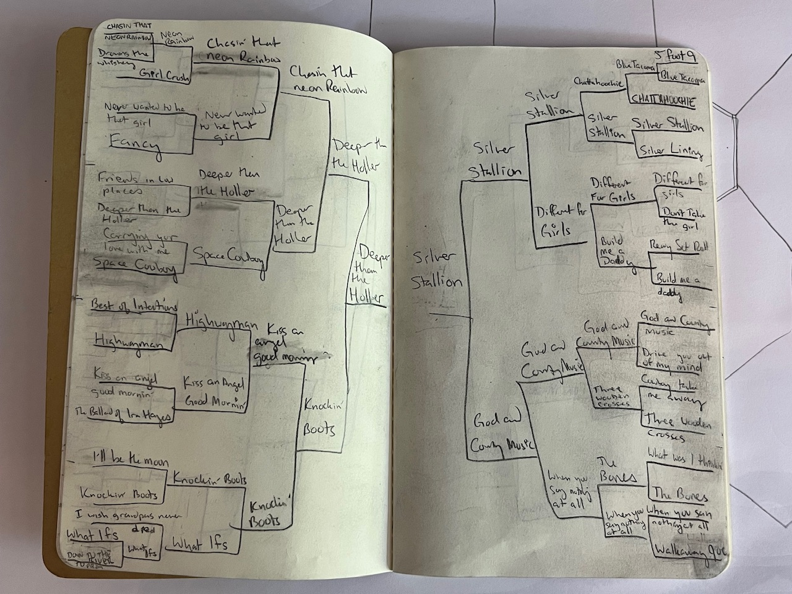
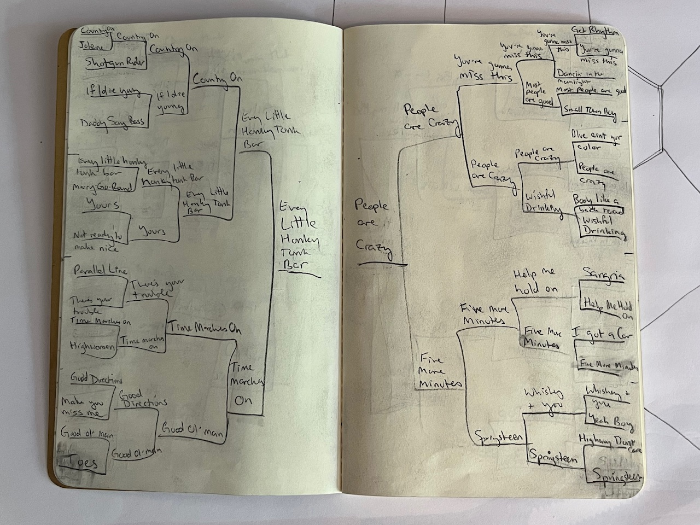
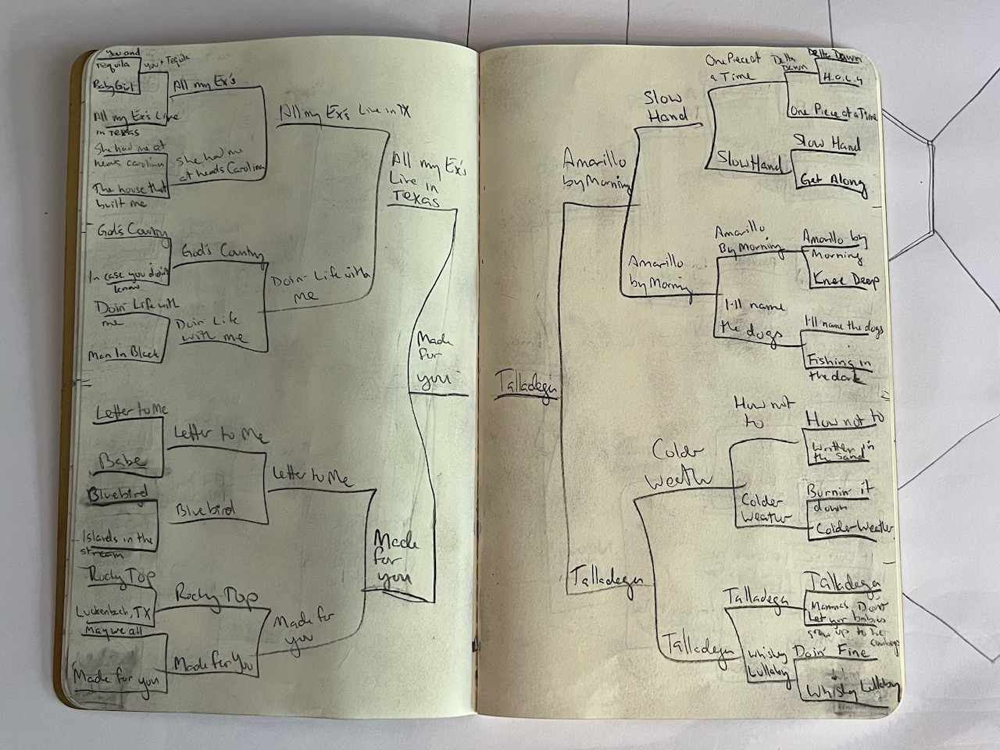
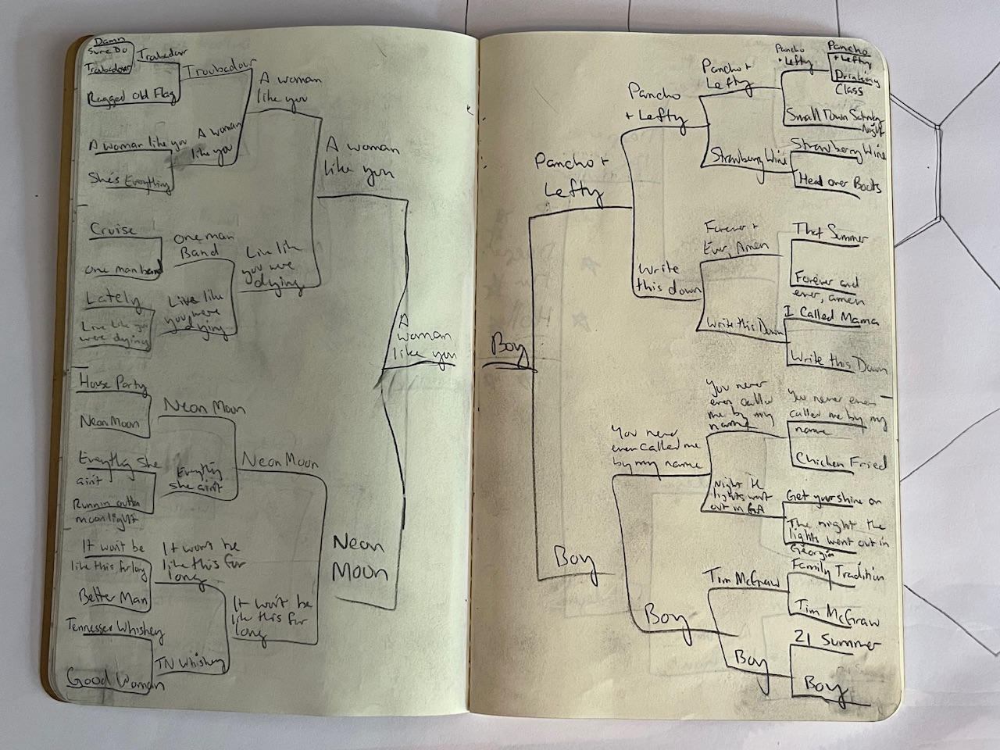
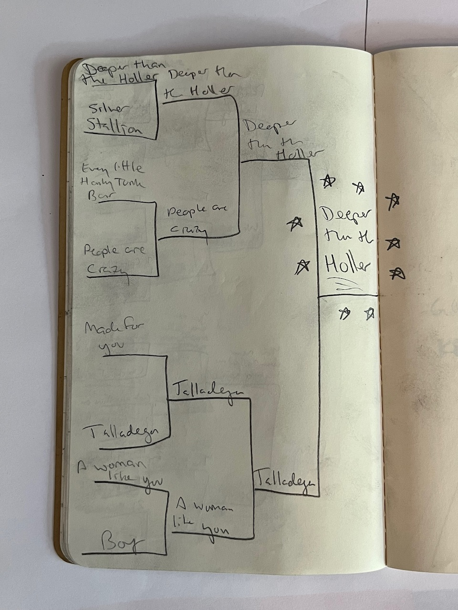

# A Yankee's Guide to Country Music

137 great country songs, bracket-style.

[Spotify Playlist](https://open.spotify.com/playlist/4s7ed8vbikQMKo6rgOWyMk)

Six years of living in Nashville, Tennessee imprinted country music on my soul. In November 2023, I took stock of all the great country songs I had collected to date and hashed out the best of the best. A tournament seems more appropriate than trying to provide a linear rank, especially once you get into the long tail. Some matchups were no-brainers. Others were agonizing. Most decisions were made up by how close the song is to my heart, not what popular vote would say (apologies again to Miss Dolly Parton for knocking you out first round).

If you're a Yankee, I hope this helps you find your way around this beautiful genre of music I myself never grew up with. You may find it a breath of fresh and meaningful air compared to the all-too-common vapidity of lyrics in pop, electronic, and rap music.

And if you're from the South and you already know what's good, feel free to roast me :)

## Silverado Conference

### Silverado Conference - West

**_Deeper than the Holler - Randy Travis_** - I discovered Randy Travis early on living in Nashville. Classic country love song that never gets old.

_Chasin' That Neon Rainbow - Alan Jackson_ - I discovered Alan Jackson late, more classic country you'll find playing every night down on Broadway.

_Friends in Low Places - The Deep Dixie Boys_ - This classic honky tonk anthem lost in the first round, but should be in the top of anyone's country karaoke repertoire.

_Space Cowboy - Kacie Musgraves_ - A sad country song from one of the most prolific country singers out there.

_Kiss an Angel Good Mornin' - Charlie Prine_ - I may have suffered some recency bias since I discovered this in the last month or so living in Nashville, but what a love song.

_Knockin' Boots - Luke Bryan_ - One of the catchiest songs of all time.

### Silverado Conference - East

**_Silver Stallion - The Highwaymen_** - The Highwaymen are a Country super-group made up of Willie Nelson, Johnny Cash, Waylon Jennings, and Mearl Haggard. Open up the throttle on your pickup on a wide-open country road and let this outlaw country shred your soul, baby.

_Different for Girls - Dierks Bentley_ - A feminist anthem about guys and gals breaking up, Dierks was in the steady rotation when I first moved to Nashville.

_God and Country Music - George Strait_ - The King of Country had the most songs of any artist in this category and this is him at his best. This song has grown on me so much that it would probably win the whole thing if I did it again.

_When You Say Nothing At All - Allison Krauss_ - A beautiful little love song.

_Build Me a Daddy - Luke Bryan_ - Get the tissues ready, this one's a doozy, I can't even think about this song without getting all goosepimply.

_Three Wooden Crosses - Randy Travis_ - More Randy Travis at his storytelling best about a farmer and a teacher, a hooker and a preacher, on a greyhound bus bound for Mexico.

## Cold Beer Conference

### Cold Beer - West

**_Every Little Honky Tonk Bar - George Strait_** - Friday night, it's a given - I'll be L-I-V-N livin', till we dance on the bar and we're sleepin' it off in the caaarrrrrrrrr. Nothing captures the Honky Tonk spirit quite like this little diddy from George Strait.

_Time Marches On - Chase Adkins_ - The best example of eternal storytelling country, and why the genre will still be recognizable fifty years from now.

_Good Ol' Man - Drew Green_ - Awesome one-hit-wonder dad country about a good ol' boy just tryin' to be a good ol' man, there's no better soundtrack to becoming a parent than this brand of country.

_Country On - Luke Bryan_ - Yeehaw, as country as country gets, Luke Bryan never disappoints.

_Jolene - Dolly Parton_ - Miss Dolly Parton lost in the first round to Luke Bryan and it'd be an affront to all country sensibilities if I didn't mention this wonderful woman and this classic country ballad.

_Highwomen - The Highwomen_ - A modern country super-group of gals including Marren Morris that makes awesome tracks on par with the great Highwaymen, this track probably could've gone far if it weren't knocked out early.

_Good Directions - Billy Currington_ - Billy Currington makes fun storytellin' country that you can listen to just about anytime, and was the first country concert I ever went to.

_Toes - Zac Brown Band_ - Y'all know this one, it's great, had to include it, but ZBB got popped first round and I think they've got plenty better songs in their discography anyway.

### Cold Beer - East

**_People are Crazy - Billy Currington_** - God is great, beer is good, and people are crazy, nothing truer was ever said in the world.

_Five More Minutes - Scotty McCreery_ - Eternal country about time slippin' by, heartbreaking, uplifting, awesome little country song.

_Springsteen - Eric Church_ - Chief can really paint a picture of how beautiful it is to be young and how music can always bring you back.

_You're Gonna Miss This - Trace Adkins_ - Some more heartbreaking country about slowing down to take it all in.

_I Got a Car - George Strait_ - I've cried drunk listening to how beautiful this love song is. I've listened to more George Strait than anything else since leaving Nashville. Tough first-round loss, would've probably gone far if it had an easier bracket.

_Wishful Drinking - Ingrid Andress, Sam Hunt_ - This is kinda corny but I love this modern poppy country tune.

## County Line Conference

### County Line - West

**_Made for You - Jake Owen_** - Like a ship without a sea, or a song without a melody, I don't know where I'd be or what I'd do, cause I was made for you. This one almost made the cut for the string trio to play as we walked down the aisle, that's how integral it is to the early Nashville falling in love story.

_All my Ex's Live in Texas - George Strait_ - Just a classic, feel-good, funny ballad that'll never get old.

_Letter to Me - Brad Paisley_ - If I can share this with my kids when they're teenagers and going through tough stuff and it helps at all to cheer them up, I'll write Brad Paisley a letter myself to thank him for writing one of the best timeless country songs of all time.

_Doin' Life with Me - Eric Church_ - Classic jam about friends and family and what's important, Eric Church tugging on the ol' heart strings like he does so well.

_In Case you Didn't Know - Trent Tomlinson_ - This was an early loss to another pretty great Blake Shelton track, but this was early Nashville for me and is a great love song that never gets old.

_May We All - Florida Georgia Line_ - FGL is as bro country as it gets, and I came to realize that I really dig a lot of bro country. Feel good summer vibes, this is a classic.

### County Line - East

**_Talladega - Eric Church_** - Eric Church at his best, painting a picture of a roadtrip with friends during the summer before the real world started.

_Amarillo by Morning - George Strait_ - The first time I heard this was five beers deep in a smoke-filled haze at Santa's Pub in Nashville and my classically-trained-opera-singing-friend whipped out this classic country ballad and brought the house down. Core memory.

_Slow Hand - Conway Twitty_ - I discovered Conway Twitty once I started exploring the classics, and can't believe I missed this one for so long. Play this one with your lover after a bottle of wine or two out on the front porch on a hot summer night to set the mood right ;)

_Colder Weather - Zac Brown Band_ - There's a lot of hurt in a ramblin' man's heart, and ZBB shows you exactly what it feels like.

_One Piece at a Time - Johnny Cash_ - It took me a long time to discover Johnny Cash's deep discography. Funny, light, upbeat storytelling country is his bread-and-butter, can't recommend enough.

_Get Along - Kenny Chesney_ - This is the boat rock anthem and some wholesome great advice from a country superstar.

_Burnin' it Down - Jason Aldean_ - Kinda corny but honestly this is some first date music that might seal the deal if you time it right, I unapologetically love this song.

_Whiskey Lullaby - Brad Paisley, Allison Krauss_ - Woof, this is as brutal as it is beautiful.

## John Deere Conference

### John Deere - West

**_A Woman Like You - Lee Brice_** - A super simple timeless love song.

_Neon Moon - Brooks and Dunn_ - The finest heartbreak country song you'll ever listen to. The Kacie Musgraves cover is also amazing.

_Live Like You Were Dying - Tim McGraw_ - Everyone's heard this, it's corny, it's sincere, it's a beautiful song about what's important in life.

_It Won't Be Like This For Long - Darius Rucker_ - More country from the eternal viewpoint, I remember tearing up in a CVS parking lot listening to this after our daughter's first doctors visit, thinking about how some day soon that little girl's gonna be all grown up and gone. Songs like this really do help you cherish things in the best way, thank you Mr Rucker.

_Ragged Old Flag - Johnny Cash_ - Man, if you want to get the chills thinking about America the beautiful, have I got a song for you.

_She's Everything - Brad Paisley_ - If you love your lady and everything she's got going on, throw this pup on and show her how you feel.

### John Deere - East

**_Boy - Lee Brice_** - If Darius Rucker or Tim McGraw wrote the canonical girldad song, this is the canonical song about having a son, how he's gonna be just like you, and how you're gonna be there every step of the way. This one hits different.

_Pancho and Lefty - Mearl Haggard_ - All the federales say they could've had him any day, they only let him slip away, out of kindness I suppose.

_Write this Down - George Strait_ - George Strait, yet again.

_You Never Even Called Me By My Name - David Allen Coe_ - You're officially a Nashvillian if you know every word to this song and can belt it out along with everyone at Tequila Cowboy.

_Strawberry Wine - Deana Carter_ - Country canon. I've got a core memory of twenty very drunk friends belting this out at a New Years party many moons ago. Is it my youth or the loss of my innocence I've been missing so much?

_Tim McGraw - Taylor Swift_ - Track 1 from Taylor's first album. This is one of her few pure country songs and is one of my absolute favorites of all time.

## The Final Eight

Congratulations to Randy Travis for taking home the title with _Deeper than the Holler_. Country music is a lot of things but it's mostly about writing love songs, and there's no love song that's more country than singing about how different you are than them city singers.

## Notable omissions

I knew going in that I hadn't saved every great country song, so calling out some notable misses below seems appropriate.

_Heads Carolina, Tails California - ???_ - I literally had the catchy cover in this batch but not the original catchy cover.

_My Little Girl - Tim McGraw_ - can't believe I missed this!

_Walking in Memphis - Marc Cohn_ - Heard this one at Santa's too.

_Nine to Five - Dolly Parton_ - This is more poppy, but it's still Dolly.

